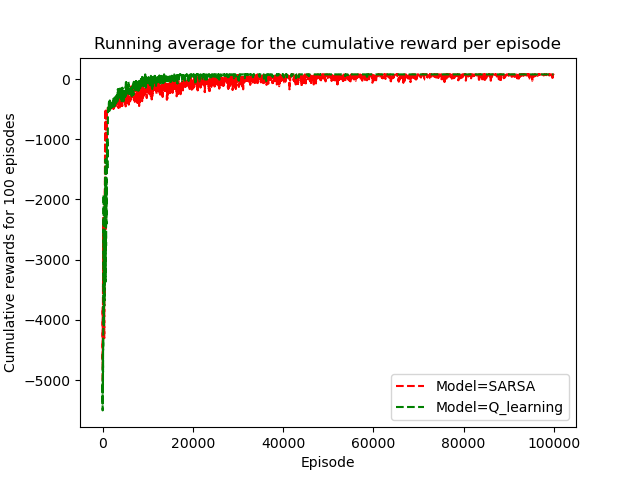

# Path Planning using Q-learning and the Sarsa Methods

## Overview
This repository provides a basic implementation of the Q-learning and Sarsa methods from scratch. The project focuses on using the previously created OpenAI gym environment which can be accessed using [this link](https://github.com/SajjiKazemi/cube_gym).

### Disclaimer
This code was tested on Ubuntu 20.04.
### Prerequisites

1. [Anaconda](https://www.anaconda.com/products/distribution) / [Miniconda](https://conda.io/projects/conda/en/stable/user-guide/install/download.html)
   
## Getting Started

### Clone the Repository

```bash
git clone https://github.com/SajjiKazemi/qlearning_path_planner.git
```

## Dependencies
Create a virtual environment using the provided gym.yml file:

```bash
conda env create -f gym.yml
```
Activate the environment:

```bash
conda activate gym
```

## Example Plots
As follows, two plots, as examples, resulting from the code have been shown to compare the performance of the two implemented models for the considered specific problem.




## Contact
For any questions or feedback, feel free to reach out:

Email: sajjikazemi@uwaterloo.ca

LinkedIn: www.linkedin.com/in/sajjadkazemi
